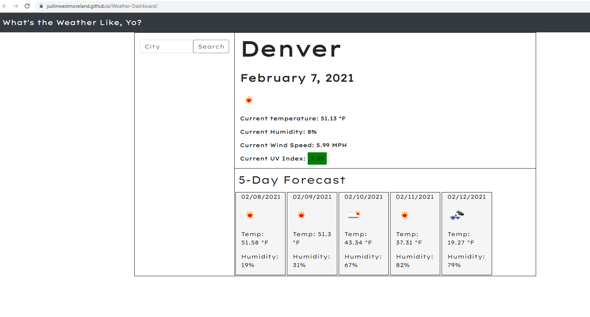

# Weather-Dashboard

This project was a ground up build of a weather forecast site using OpenWeather APIs.

On this site users are able to search a city of their choice and get both the current weather and the 5 day forecast for that city. Users search history is saved in local storage and they are able to click the previous search city to see that data. 

The site will also alert users to the current UV index for their searched city with separate styling to indicate green, yellow, or red UV risk. 

The website was designed with Bootstrap framework and the site was designed to be compeletely mobile responsive. 

To style the website I decided to keep it simple as to not distract from the data being displayed. I used simple greys to bring attention to the forecast boxes.

Both the current and forecasted weather will give the users a visual representation of what the weather will look like by using an icon.

If users accidentally navigate away from the page or refresh, all search results are saved in the browswers local memory so they are able to come back if they forget the weather

Enjoy my website!

